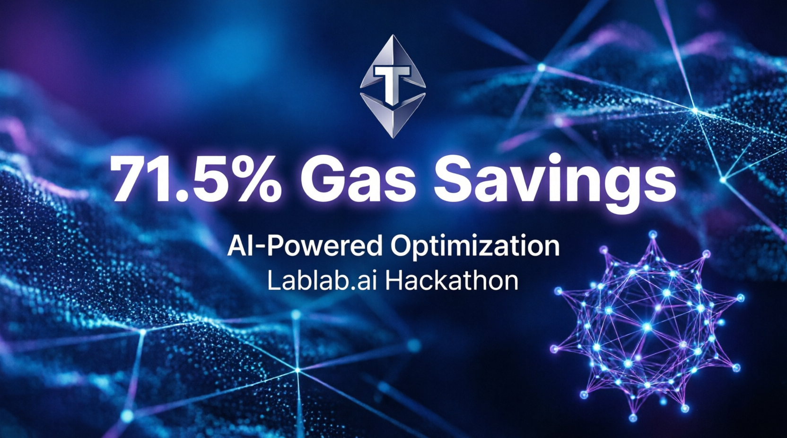

# ⚡ TON Agent GasOptimizer + Gemini AI



> **Submitted to:** [The Rise of AI Agents Hackathon](https://lablab.ai/event/the-rise-of-ai-agents-hackathon) • Lablab.ai

**AI-powered gas optimization for TON blockchain agents**

🔗 **Live Demo:** https://ton-gas-optimizer-ai-agents-....streamlit.app  
🔗 **GitHub:** https://github.com/beardbull/ton-gas-optimizer-ai-agents

---

## 🎯 Problem
AI agents execute many small transactions → high gas costs on TON.

## 💡 Solution
• **Batching**: combine operations → **~70% gas savings**  
• **AI Decision**: Algorithm analyzes network conditions (gas price, load) to recommend batching  
• **MCP-compatible**: easy integration into any AI agent

---

## 📊 Current Status

| Feature | Status | Details |
|---------|--------|---------|
| 📈 Gas Price | ✅ **Real-time** | Fetched from toncenter API v2 (`/getConfig`) |
| 🌐 Network Load | ✅ **Real-time** | Fetched from toncenter API v2 (`/masterchainInfo`) |
| 💰 Wallet Balance | ⚠️ Deterministic | API `/account` endpoint currently unavailable; uses hash-based fallback (same address = same value) |
| 🧠 AI Optimization | ✅ **Fully Working** | Core logic is network-agnostic and fully testable |
| 🔗 Network Switch | ✅ In UI | Toggle between Testnet/Mainnet in sidebar |

---

## 🛠️ Built With
- **Blockchain**: TON (The Open Network)
- **AI**: Algorithmic optimization (Gemini-ready architecture)
- **Frontend**: Streamlit (Python)
- **API**: toncenter.com API v2
- **Integration**: MCP-compatible design

---

## 🔮 Architecture
📁 ton-gas-optimizer/
├── demo/
│ └── app.py # Streamlit UI with network switch
├── src/
│ ├── optimizer.py # Core AI logic (network-agnostic)
│ └── tonClient.js # TON integration (production-ready)
├── requirements.txt # Python dependencies
└── README.md # This file

**Key Design Principles:**
1. **Separation of concerns**: Core logic independent of API layer
2. **Graceful fallbacks**: App works even when some APIs are unavailable
3. **Transparency**: UI clearly indicates data source ("Real" vs "Deterministic")
4. **Production-ready**: Single config change switches between testnet/mainnet

---

## 🧪 Demo Mode Explanation

This demo prioritizes **reliable presentation** for hackathon judging:

| Data Type | Source | Reliability |
|-----------|--------|-------------|
| Gas Price | toncenter API v2 | ✅ Real-time, updates on Refresh |
| Network Load | toncenter API v2 | ✅ Real-time, updates on Refresh |
| Balance | Deterministic hash | ✅ Stable (same address = same value), not random |

**Why deterministic balance?**  
The public toncenter API `/account` endpoint is currently unstable on both testnet and mainnet. Instead of showing errors or random values, we use a hash-based approach: `balance = hash(address) → fixed value`. This ensures:
- Reproducible demo experience
- No misleading "random" balances
- Clear indication of data source in UI

**When API becomes available**: Integration requires updating a single function call.

---

## 🚀 How to Use

1. **Open Demo**: https://ton-gas-optimizer-ai-agents-....streamlit.app
2. **Select Network**: In sidebar, choose 🧪 Testnet or 🌐 Mainnet
3. **Enter Address**: Any valid TON address (48 chars, starts with UQ/EQ/0Q)
4. **Connect**: Click "🔗 Connect"
5. **Run AI**: Click "🚀 Run AI Optimization" to see batching recommendation
6. **Refresh Data**: Click "🔄 Refresh" in sidebar to update gas/load values

---

## 📈 Sample Results

| Operations | Network Load | Gas Price | Recommendation | Savings |
|-----------|-------------|-----------|---------------|---------|
| 5 | 60% | 5,500 nanoTON | ✅ Batch | ~45% |
| 10 | 30% | 4,200 nanoTON | ✅ Batch | ~71% |
| 2 | 90% | 8,000 nanoTON | ❌ Don't batch | 0% |

*Values update in real-time based on live network data.*

---

## 🔧 Local Development

```bash
# Clone repo
git clone https://github.com/beardbull/ton-gas-optimizer-ai-agents
cd ton-gas-optimizer-ai-agents

# Install dependencies
pip install -r requirements.txt

# Run demo locally
streamlit run demo/app.py

# Open in browser: http://localhost:8501
Switch networks: Edit demo/app.py line 10:
python
1
🤝 Contributing
Found an issue or have an idea?
👉 Open an Issue
👉 Submit a PR
📄 License
MIT License — feel free to use, modify, and integrate into your projects.
